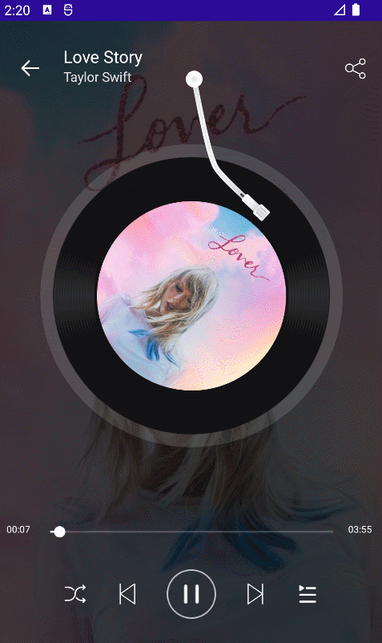
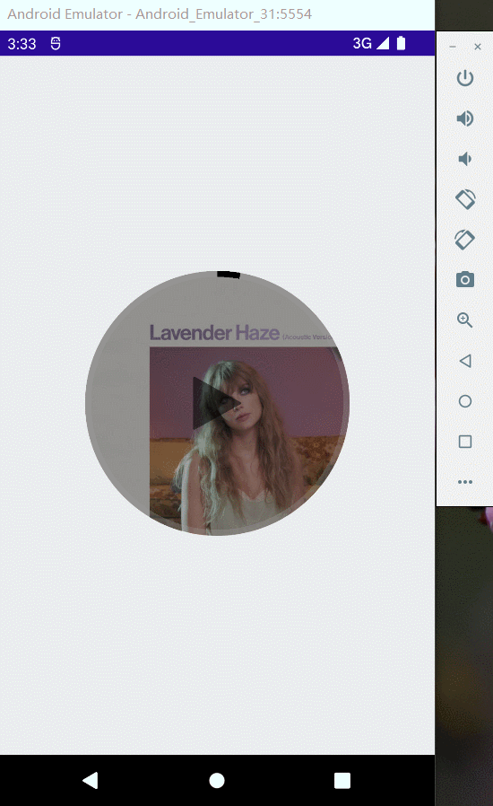
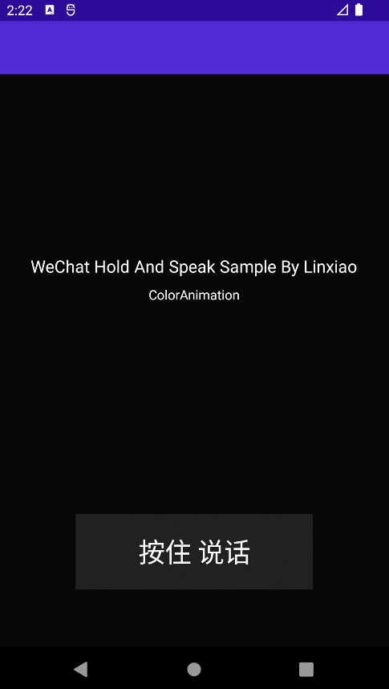
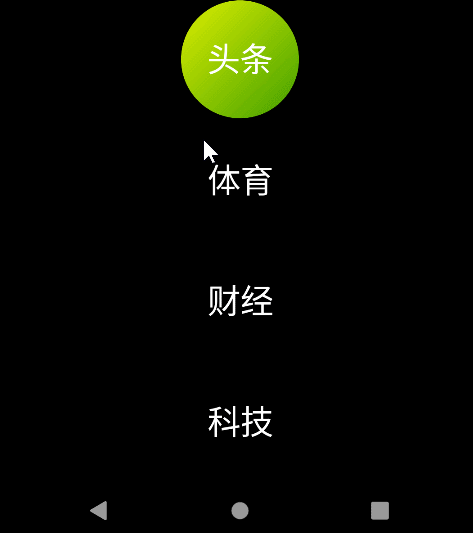
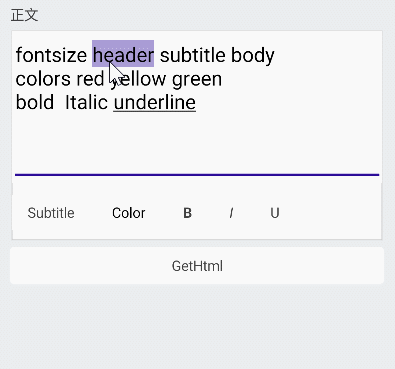
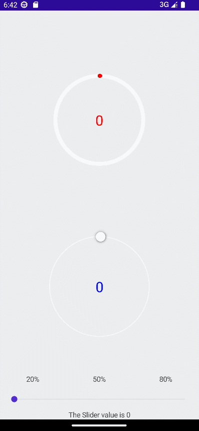
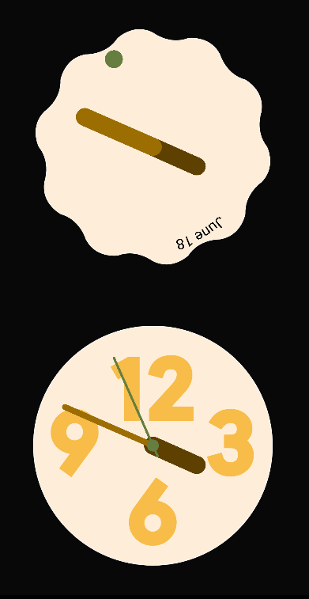
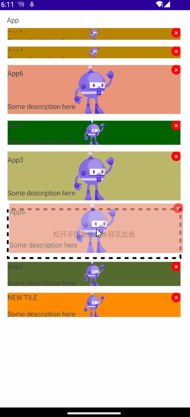

# MAUI-Samples

这是一个 .NET MAUI 的示例项目，请使用最新的VisualStudio 2022版本打开。

## 模仿网易云音乐黑胶唱片的交互实现

博文地址：[[MAUI]模仿网易云音乐黑胶唱片的交互实现](https://blog.csdn.net/jevonsflash/article/details/130353772)

## 手势控制音乐播放器

博文地址：
* [[MAUI 项目实战] 手势控制音乐播放器（一）： 概述与架构](https://blog.csdn.net/jevonsflash/article/details/130031596)
* [[MAUI 项目实战] 手势控制音乐播放器（二）： 手势交互](https://blog.csdn.net/jevonsflash/article/details/129915210)
* [[MAUI 项目实战] 手势控制音乐播放器（三）： 动画](https://blog.csdn.net/jevonsflash/article/details/130029828)
* [[MAUI 项目实战] 手势控制音乐播放器（四）：圆形进度条](https://blog.csdn.net/jevonsflash/article/details/129947163)

## 模仿微信“按住-说话”的交互实现

博文地址：[[MAUI]模仿微信“按住-说话”的交互实现](https://blog.csdn.net/jevonsflash/article/details/130174276)

## 在.NET MAUI中复刻苹果Cover Flow

博文地址：[[MAUI]在.NET MAUI中复刻苹果Cover Flow](https://blog.csdn.net/jevonsflash/article/details/130798337)

## 模仿iOS多任务切换卡片滑动的交互实现

博文地址：[[MAUI]模仿iOS多任务切换卡片滑动的交互实现](https://blog.csdn.net/jevonsflash/article/details/130465814)

## 模仿Chrome下拉标签页的交互实现

博文地址：[[MAUI]模仿Chrome下拉标签页的交互实现](https://blog.csdn.net/jevonsflash/article/details/130914928)

## 写一个跨平台富文本编辑器

博文地址：[[MAUI]写一个跨平台富文本编辑器](https://blog.csdn.net/jevonsflash/article/details/131159341)

## 弧形进度条与弧形滑块的交互实现

博文地址：[[MAUI]弧形进度条与弧形滑块的交互实现](https://blog.csdn.net/jevonsflash/article/details/131271480)

## 用纯C#代码写两个漂亮的时钟

博文地址：[[MAUI]用纯C#代码写两个漂亮的时钟](https://blog.csdn.net/jevonsflash/article/details/131335776)

## 在.NET MAUI中实现可拖拽排序列表

博文地址：[[MAUI]在.NET MAUI中实现可拖拽排序列表](https://blog.csdn.net/jevonsflash/article/details/132298036)